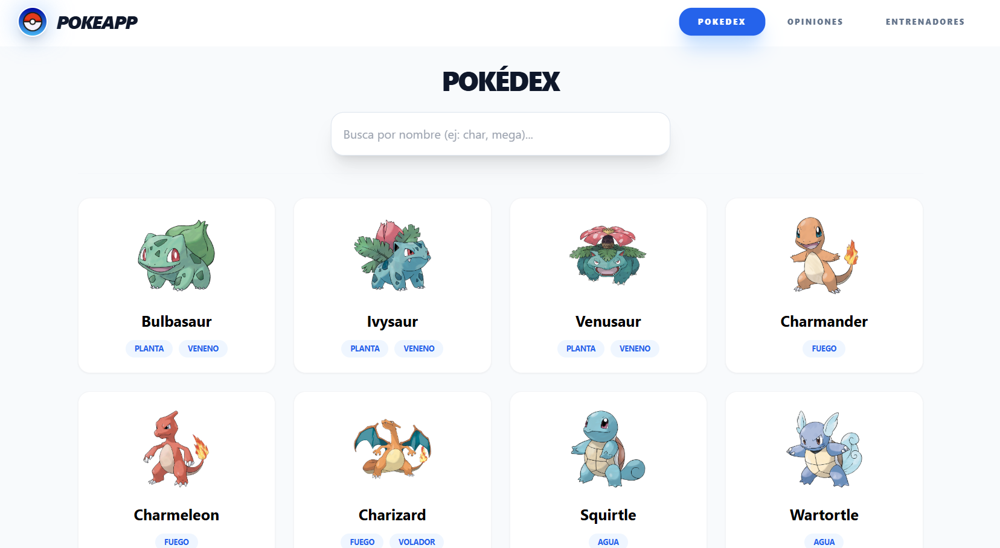
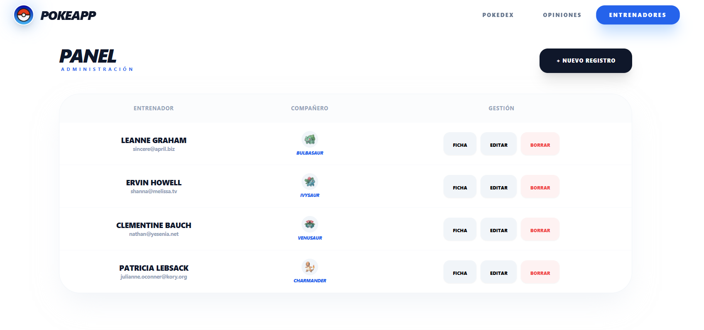
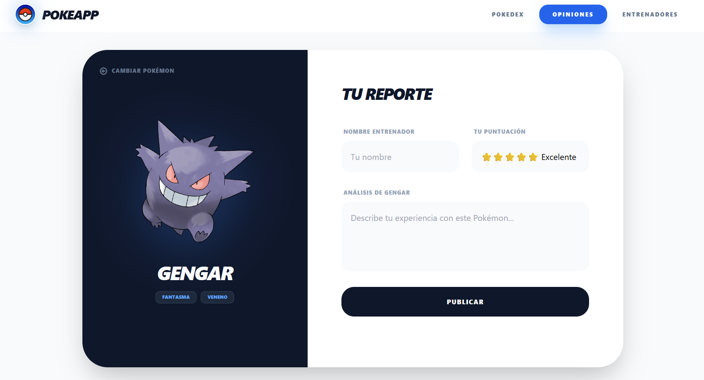

# PokeApp 


Sistema de gestión integral de entrenadores y catálogo de Pokémon, desarrollado con un enfoque en rendimiento, escalabilidad y una experiencia de usuario (UX) fluida. La aplicación conecta datos dinámicos de la **PokeAPI** y simulaciones de persistencia con **JSONPlaceholder**.

---

## Capturas de Pantalla


### 🔴 Vista de Catálogo (Pokedex)
  
> *Exploración de especies con scroll infinito y renderizado optimizado.*


### 🟡 Gestión de Staff (Entrenadores)
  
> *CRUD completo con animaciones y vinculación de Pokémon.*


### 🔵 Feedback (Opiniones)
  
> *Módulo de interacción para recolección de feedback de la comunidad de entrenadores.*

---

## Funcionalidades Principales

> [!IMPORTANT]
> **Arquitectura de Gestión Asíncrona**
> Se utiliza **TanStack Query (React Query)** para manejar la sincronización de datos, caché y estados de carga, asegurando que la UI nunca se bloquee.

* **Pokedex Dinámica:** Catálogo de Pokémon con consumo directo de la PokéAPI.
* **Gestión de Staff (CRUD):** Módulo completo para crear, editar y eliminar entrenadores con persistencia en `localStorage`.
* **Sistema de Opiniones:** Espacio interactivo para gestionar feedback y comentarios.
* **Validación Robusta:** Formularios protegidos con **Zod** y **React Hook Form** para prevenir datos corruptos.
* **Animaciones de Interfaz:** Transiciones suaves de entrada y salida de elementos con **Framer Motion**.
* **Notificaciones de Feedback:** Alertas visuales inmediatas para cada acción mediante **React Hot Toast**.

---

## Stack Tecnológico

> [!NOTE]
> - **Frontend:** React 19 (última versión estable).
> - **Estilos:** Tailwind CSS con arquitectura de diseño moderno.
> - **Consumo API:** Axios con instancias modulares.
> - **Validación:** Zod + Hook Form Resolvers.
> - **Animaciones:** Framer Motion (Layout animations).
> - **Routing:** React Router DOM v7.

---

## Organización del Proyecto

La aplicación utiliza una estructura **Feature-First**, facilitando el mantenimiento y la lectura de módulos aislados:

```bash
src/
├── api/             # Configuración base y clientes Axios
├── components/      # UI Global (Navbar, Modales, Skeletons)
├── features/        # Módulos principales
│   ├── pokedex/     # Lógica y vistas de Pokedex
│   ├── opinion/     # Lógica y vistas de Comentarios
│   └── trainers/    # CRUD completo de Entrenadores
├── hooks/           # Custom hooks globales
└── lib/             # Instancias de librerías externas
